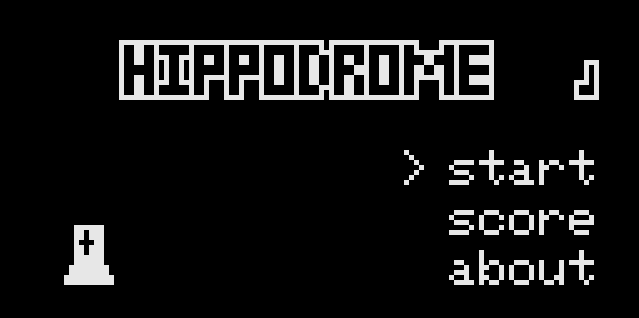

Hippodrome is a variant of single-player chess where the knights start in the first row and the rest of the pieces, except one, is randomly distributed in the remaining squares.
The game consists in taking the knights to the last row, the capture of pieces is not allowed.

This project is a version of the hippodrome chess game for Arduboy.

# Hippodrome
## Controls
### 1. Main menu

- Press the up and down arrows to scroll through the options.
- Press the left and right arrows to turn the sound off and on.
- Press button A to select an option.

### 2. Game

- Press the right and down arrows to select the next piece you can move.
- Press the left and up arrows to select the previous piece that you can move.
- Press button A to move the piece.
- Press button B to get another random game.
- Press and hold button B to return to the main menu.
At the end of the game, you will start to download a bar, at the end it will change to the scoring screen. To stop the bar momentarily, press and hold any key.

### 3. Score screen

- Press the A or B button to exit.

### 4. Score Board

- Press the A or B button to exit.

### 5. About

- Press the A or B button to exit.

### 6. Achievements

- Press the arrows to move for the achievements.
- Press the A or B button to exit.

## Achievements
To access achievements, enter the codes in the main menu:
- Down, B, Down, B; for basic achievements.
- Down, Down, B, Down, Down, B; for expert achievements.

# Gameplay

